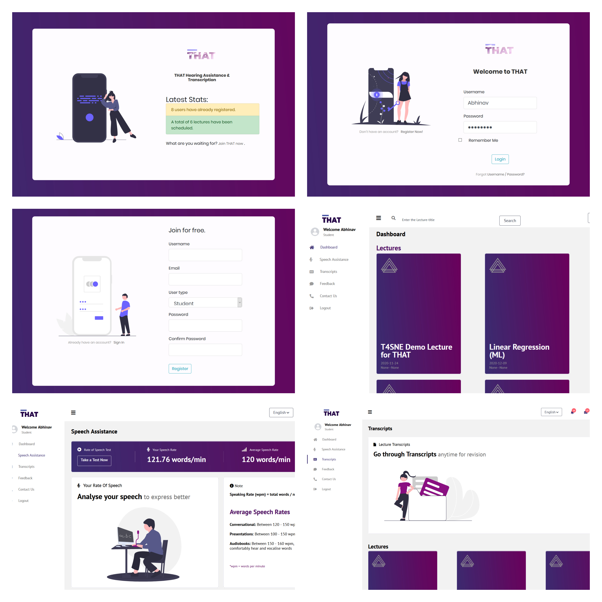
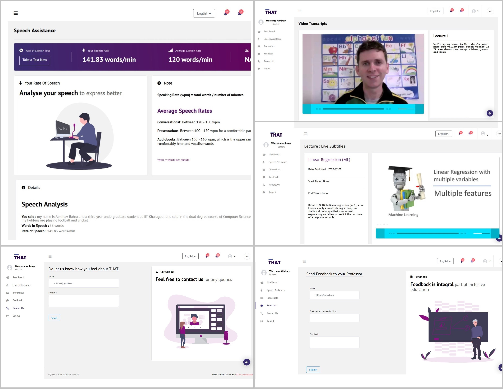
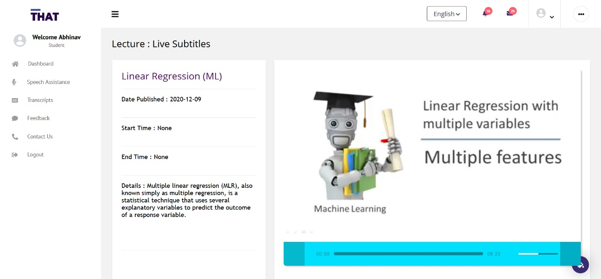
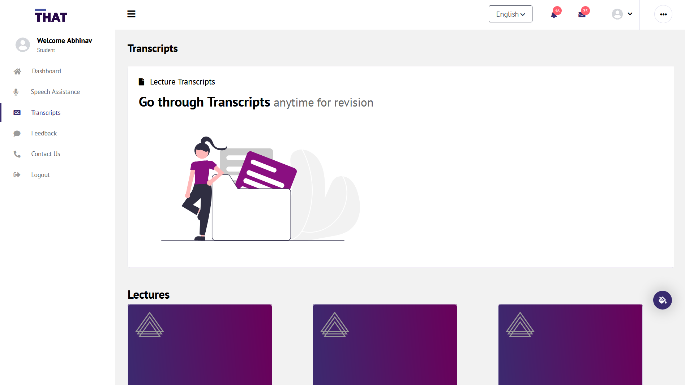
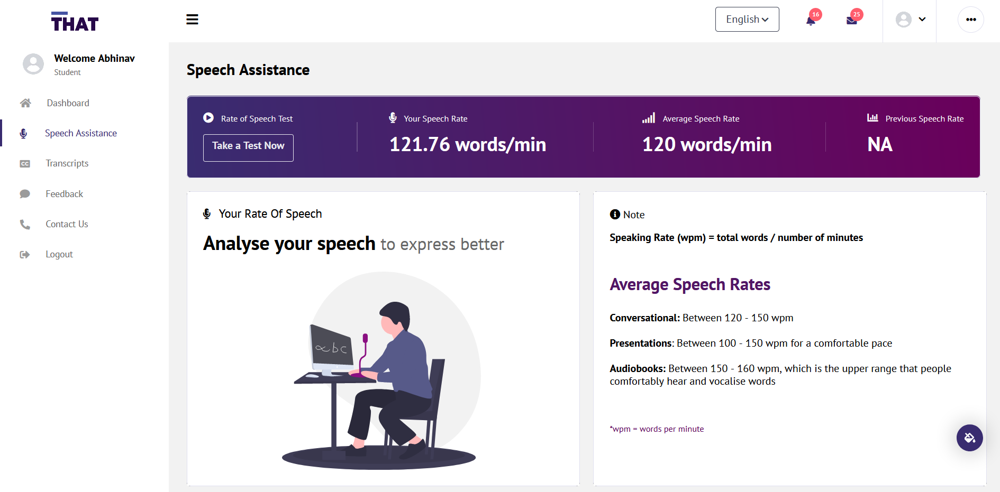

# THAT Hearing Assistance and Transcription
A webapp to improve online learning experience of people with hearing impairement and thus promote inclusive education.

## Motivation
There are over 2 million children with hearing disability in India, and out of these, around
0.8 million are either dropouts or don’t have access to education. These numbers are
staggering to even think about. It’s almost half certain that a person born with hearing
loss would be able to get proper education.

Hearing loss is not an unknown disability, it is a partial or total inability to hear and it may
be present at birth or acquired at any time afterwards. There are a number of challenges
faced by persons with this disability, but are still not so much talked about in our daily
conversation. We have tried our best to address some of those.

The biggest problem which they face on a daily basis, especially during this pandemic, is
not being able to engage in video-based communication. This can go as far as not being
able to learn from or watch any of the videos on YouTube or somewhere else on the
internet.

Not only this, another problem we realised they must be facing would be the inability to
figure out their pace of speech while speaking. It should be understandable that a person
who has hearing loss present since their birth might not be able to speak, since they
wouldn’t know how to pronounce words. And with assistance, they try to learn to speak
but still lack direction on the way of speaking.

## Screenshots
<p></p>
<p></p>

##  Objectives/ Features
### - Live Transcript
Aimed for the students who can attend lectures where the audio automatically gets
transcribed into text real-time, just like auto-generated captioning on YouTube. The
transcription starts as soon as the user hits the play button and automatically gets saved
at the end of the lecture.


<p></p>

### - Speech Assistance
Built for assisting users with their speech of rate. While speaking, the app will show the
users whether their speech is fast/perfect/slow or loud/perfect/soft. This feature helps
them to assess themselves and improve with time. This will simultaneously improve their
vocal skills as well as help them in effective communicating during the class.


<p></p>

## - Feedback Feature
An indispensable aspect for any hearing impaired student is communication. The
application allows the student to submit their feedback about the lecture. The feedback
can then be reviewed and the professor can respond to them. This will not only ensure a
smooth teaching process, but also put in place a proper communication channel
between the two.

<p></p>

## Getting Started

Download or clone this repository on your system. See deployment for notes on how to deploy 
the project on a live system.

### Prerequisites
```
- PYTHON 3.8.1
- FLASK 1.1.2
```
### Installing
- Install python3 on your system
- Add python to environment variables
- Navigate to 'Codes' folder in terminal 
- Create an evironment using the following command -> virtualenv THAT_env
- Activate the evironment using the following command  
```
     .\THAT_env\Scripts\activate   (For Windows)
      source THAT_env\bin\activate  (For Ubuntu)
```
- Run command ```pip3 install -r requirements.txt```
- Run command ```python3 application.py```
- Click on localhost link generated after execution of previous command

## Built With

* [Flask](https://flask.palletsprojects.com/en/1.1.x/) 
* [MySQLite](https://www.sqlite.org/index.html) 
* [Google Speech APIs](https://cloud.google.com/speech-to-text/)

## Contributing

Pull requests are welcome. For major changes, please open an issue first to discuss what you would like to change.
